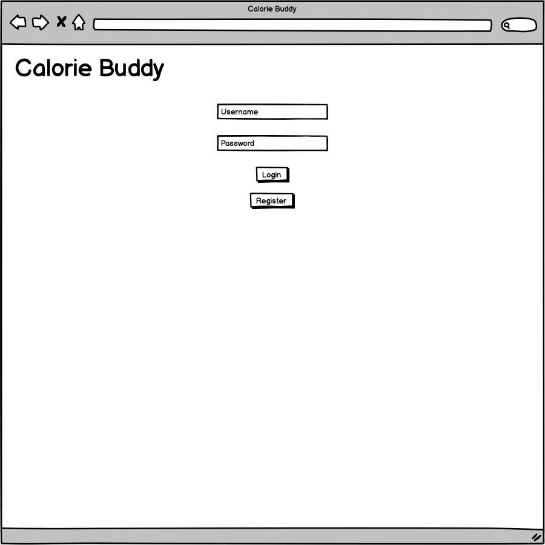
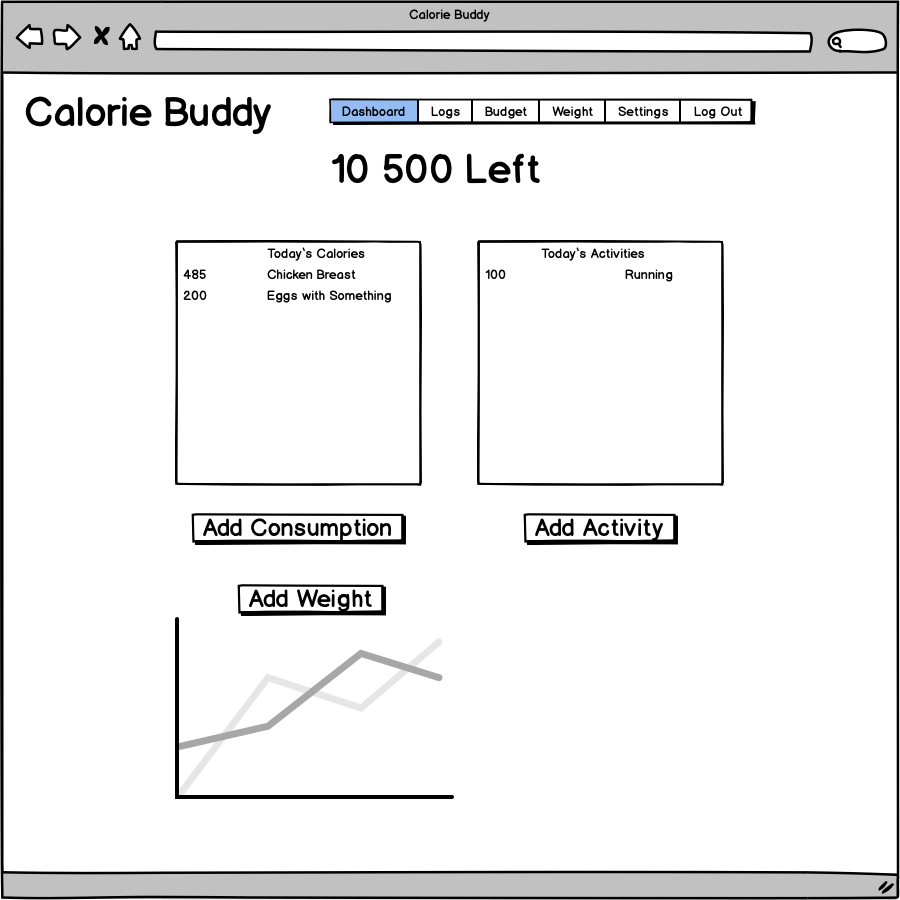
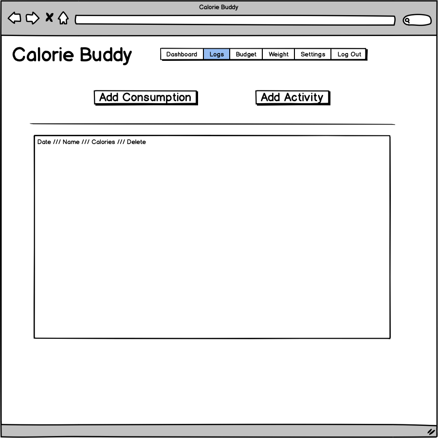
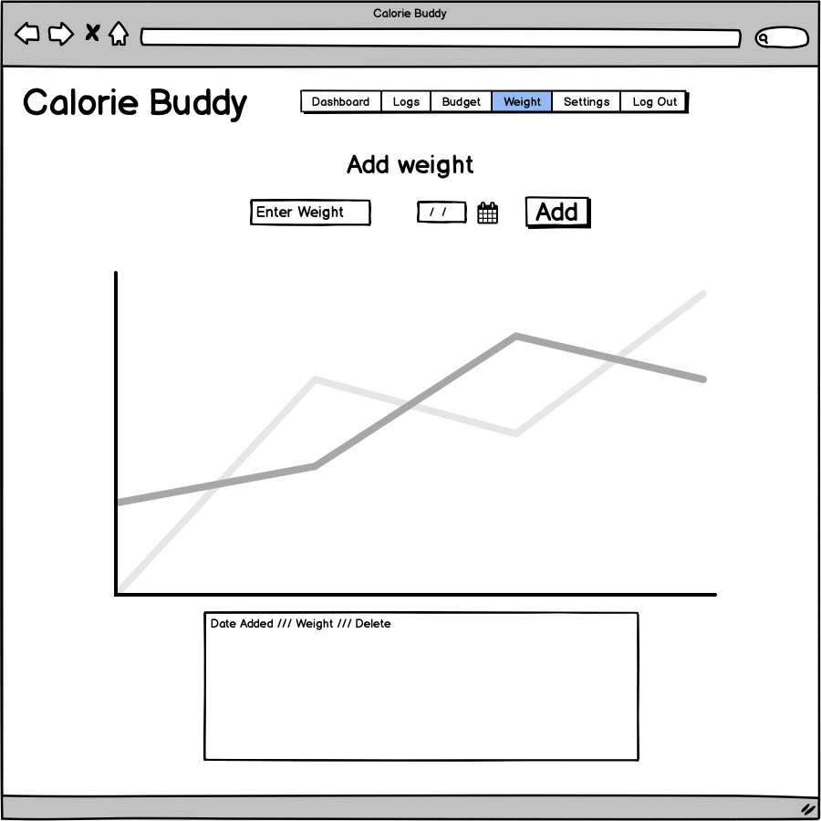
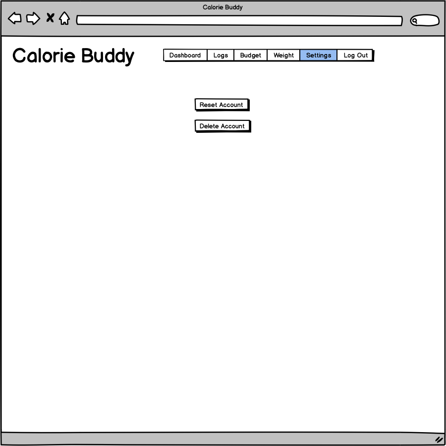

# Calorie Buddy Frontend - MVP version

## Functionality
- A simple daily calorie tracker with 2 minimal extra features:
  - Can define what % of the activites calories to add to the daily consumption budget
  - Can define what % of the unsued daily calories to carry over to the next day
  
- Can add your weight daily, even future weights, no controll over day. One weight a day, if you add it again it just updates the previous value
- Can add your own consumptions and activities, names are not required just a calorie value
- Can reset your account data, or delete your account

## Wireframes

